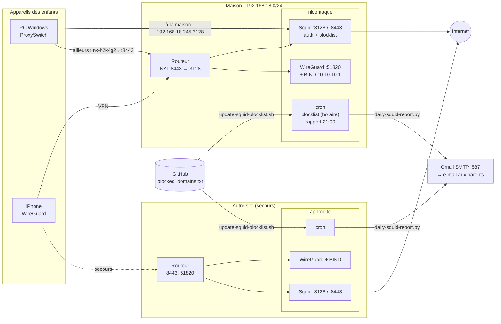

# Proxy familial

Contrôle parental maison : les appareils des enfants passent par un proxy **Squid** avec identifiant,
qui bloque une liste de domaines (adulte, vidéo, réseaux sociaux, jeux, IA, jeux d'argent, VPN…)
et envoie chaque soir un rapport par e-mail aux parents.

Deux serveurs indépendants, configurés à l'identique :

| Serveur | Rôle | Réseau | Accès depuis Internet |
|---|---|---|---|
| **nicomaque** (Debian 12, Squid 5.7) | principal | `192.168.18.245` | `nk-h2k4g2.flox-arts.net:8443` (routeur : 8443 → 3128) |
| **aphrodite** (Raspberry Pi, Debian 11, Squid 4.13) | secours, autre site | `192.168.18.210` | `nk-j8b3b7.flox-arts.net:8443` |

## Schéma

## Ce qui est bloqué

- **`blocked_domains.txt`** : la liste, rechargée toutes les heures par chaque serveur.
  Une entrée `.exemple.com` bloque le domaine et tous ses sous-domaines.
  Toute modification passe par une MR ; une fois fusionnée, les serveurs l'appliquent dans l'heure.
- **Mot-clé** : tout domaine contenant `jeu`, `jeux` (mais pas `jeunesse`) ou `game`.
- **Page de blocage** « Homework time! » (en anglais) pour les sites en `http://`.
  Pour les sites en `https://`, le navigateur affiche sa propre page d'erreur
  (un navigateur n'affiche jamais une page envoyée par un proxy pour un site HTTPS).

## Contenu du dépôt

| Chemin | Description | Installé sur les serveurs dans |
|---|---|---|
| [`blocked_domains.txt`](blocked_domains.txt) | liste des domaines bloqués | `/etc/squid/blocked_domains.txt` (par le script) |
| [`squid/squid.conf`](squid/squid.conf) | configuration Squid (identique sur les 2 serveurs) | `/etc/squid/squid.conf` |
| [`squid/errors/ERR_HOMEWORK`](squid/errors/ERR_HOMEWORK) | page de blocage | `/etc/squid/errors-custom/` |
| [`scripts/update-squid-blocklist.sh`](scripts/update-squid-blocklist.sh) | télécharge la liste, recharge Squid, revient en arrière en cas d'erreur | `/root/squid/` |
| [`scripts/daily-squid-report.py`](scripts/daily-squid-report.py) | rapport quotidien HTML par enfant (navigateurs / applications, autorisés / bloqués) | `/root/squid/` |
| [`scripts/report.conf.example`](scripts/report.conf.example) | configuration du rapport (destinataires, SMTP) | `/root/squid/report.conf` |
| [`scripts/crontab`](scripts/crontab) | tâches planifiées | crontab de root |
| [`bind/named.conf.options`](bind/named.conf.options) | DNS des clients VPN (requêtes amont en TCP) | `/etc/bind/` |
| [`wireguard/wg0.conf.example`](wireguard/wg0.conf.example) | VPN (sans les clés) | `/etc/wireguard/wg0.conf` |
| [`system/`](system/) | IPv6 désactivé, `resolv.conf` | `/etc/sysctl.d/`, `/etc/` |
| [`Switch-proxy-ps1`](Switch-proxy-ps1), [`get-ssid.ps1`](get-ssid.ps1) | bascule automatique du proxy sur les PC Windows | `%LOCALAPPDATA%\ProxySwitch\` |

## Documentation

- [Installation d'un serveur](docs/server-setup.md)
- [Setup des PC Windows (ProxySwitch)](docs/windows-setup.md)

> [!CAUTION]
> Ce dépôt est **public**. N'y mettez jamais de mot de passe, de clé WireGuard,
> de fichier `/etc/squid/passwords` ni le mot de passe d'application SMTP.
